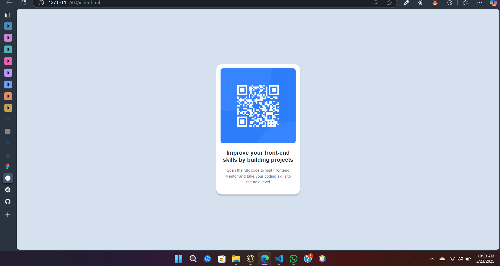
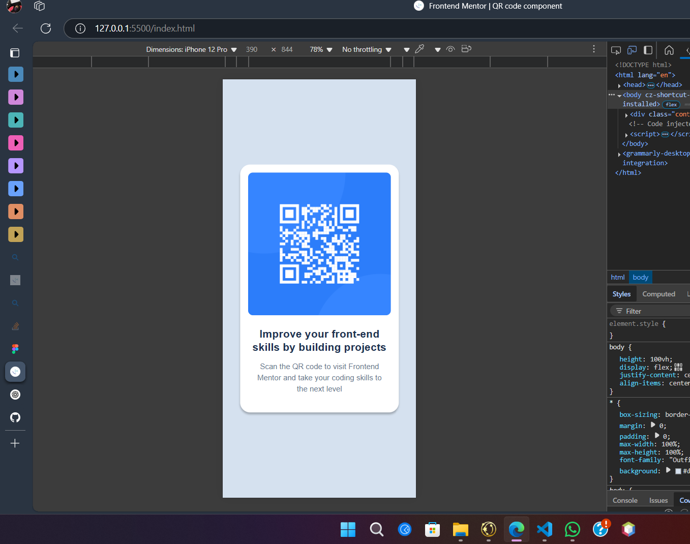

# QR Code Card Component

This is a simple QR code card component designed to improve front-end skills by building projects. The design is centered on the screen with a responsive and modern look.

## 🛠 Technologies Used
- HTML
- CSS (Flexbox for centering and styling)
- Google Fonts (Outfit)

## 📌 Features
- Responsive design
- Centered card layout
- Custom fonts and styling
- Shadow effects for depth

## 🚀 How to Use
1. Clone this repository:
   ```bash
   git clone https://github.com/KPorus/qr-code.git
   ```
2. Navigate to the project folder:
   ```bash
   cd qr-code-card
   ```
3. Open `index.html` in your browser to view the project.

## 🎨 Styling Overview
- The background color is `#d5e1ef`.
- The card has a `border-radius: 20px` for smooth corners.
- The text is styled using the **Outfit** font.
- The card includes a **sub-title** section for additional details.

## 📷 Preview




---

### 🔗 Challenge by [Frontend Mentor](https://www.frontendmentor.io?ref=challenge).
Coded by [M. Fardin Khan](#).
